# Exercise1: Blob作成/接続

## 【目次】

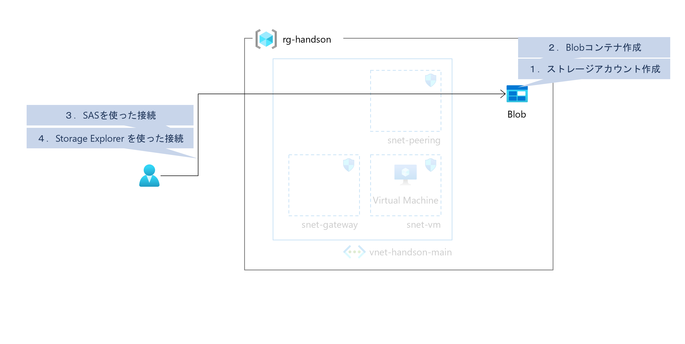

1. [ストレージアカウント作成](#ストレージアカウント作成)
1. [Blobコンテナ作成](#blobコンテナ作成)
1. [SASを使った接続](#sasを使った接続)
1. [Storage Explorer を使った接続](#storage-explorer-を使った接続)

## ストレージアカウント作成

1. Azureポータル上部の検索窓で「ストレージ」を検索、「ストレージアカウント」を開く

1. ストレージアカウント一覧画面にある「作成」を選択

1. ストレージアカウントの作成

    1. 「基本」ページ

        * サブスクリプション： （ハンズオン用のサブスクリプション）
        * リソースグループ： （ARMテンプレートで作成したリソースグループ）
        * ストレージアカウント名： （任意。ただしグローバルで重複できないのでランダムな文字列/数字を含めることを推奨）
        * 地域： `Japan East`
        * パフォーマンス： `Standard`
        * 冗長性： `LRS`

        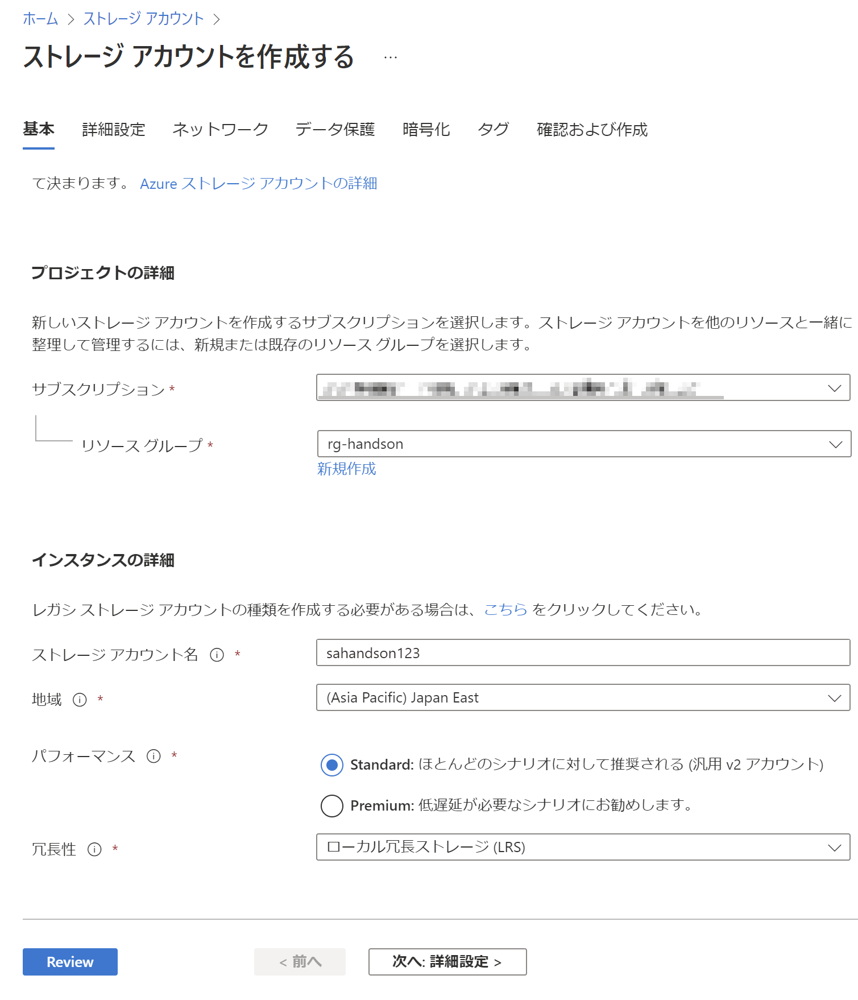

    1. 「詳細設定」ページ ~ 「タグ」ページ

        特に指定なし

    1. 「確認および作成」ページ

        内容を確認して「作成」

## Blobコンテナ作成

1. 作成したストレージアカウントを開く

1. [データストレージ]-[コンテナー]を開く

1. 「コンテナー」を選択して、「新しいコンテナー」に以下を設定して「作成」

    * 名前： （任意）
    * パブリックアクセスレベル： `プライベート`

    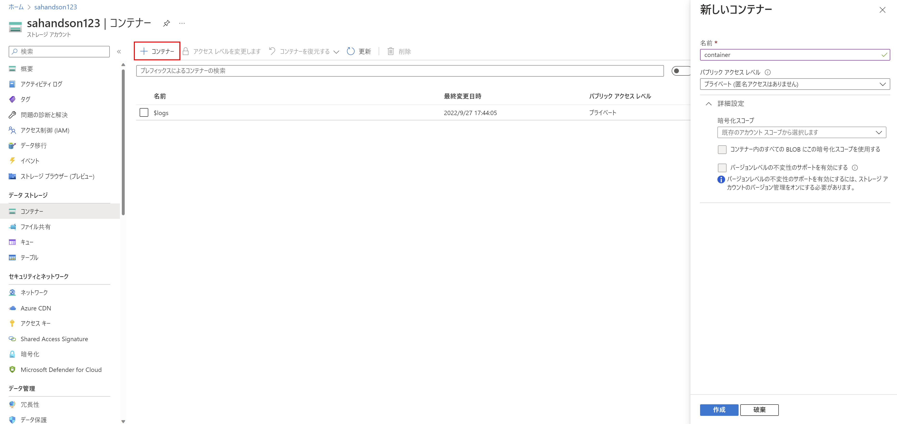

## SASを使った接続

1. 作成したコンテナーを選択して詳細表示

1. 「アップロード」を選択して、適当に作成したテキストファイルを選択、アップロード

    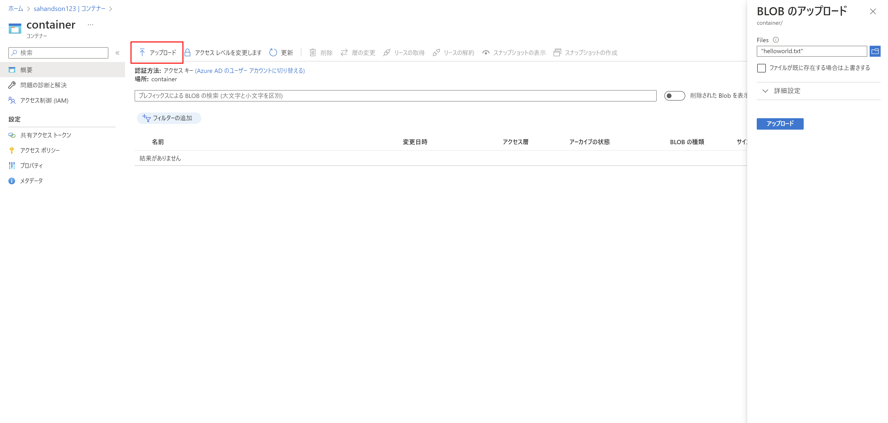

1. アップロードしたファイルの「…（メニュー）」を開き「SASの生成」を選択

    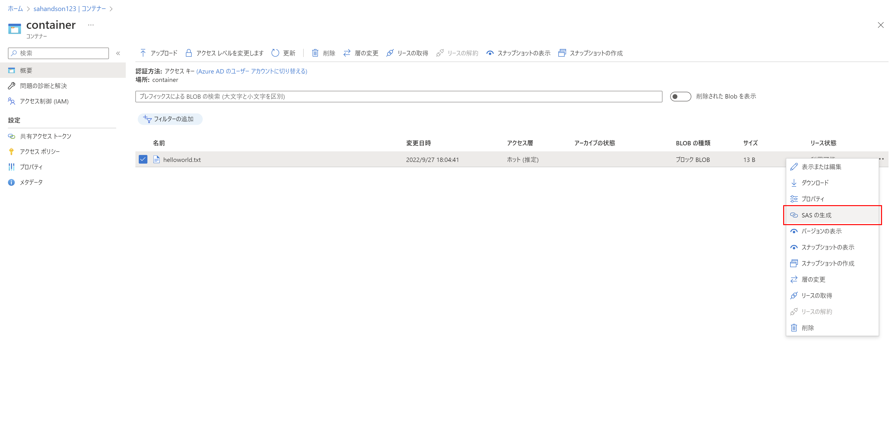

1. 「SASトークンおよびURLを生成」を選択

    

1. 生成された「Blob SAS URL」をコピー、ブラウザ（シークレットモード）を使ってアクセス

    アップロードしたテキストファイルの中身が確認できることを確認

    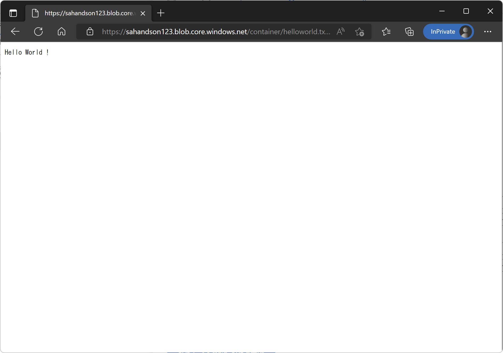

## Storage Explorer を使った接続

まだ Storage Explorer をインストールしていない場合、最初に Storage Explorer をインストールしてください。

* [Azure Storage Explorer](https://azure.microsoft.com/ja-jp/products/storage/storage-explorer/#overview)

Storage Explorer のインストールができているようであれば、以下のハンズオンへ進みます。

1. Blobへの接続文字列を取得

    1. Azureポータルにて、作成済みのストレージアカウントを開く

    1. [セキュリティとネットワーク]-[アクセスキー]を開く

    1. `key1` にある `接続文字列` を表示してコピーしておく

        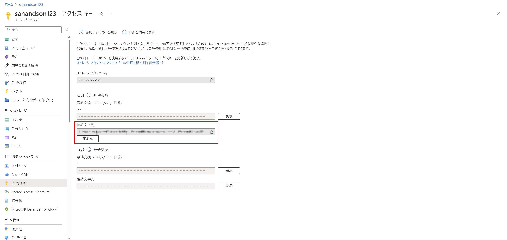

1. Storage Explorer を使って Blob へ接続

    1. Storage Explorer を起動

    1. 左メニューにある「接続」を選択

        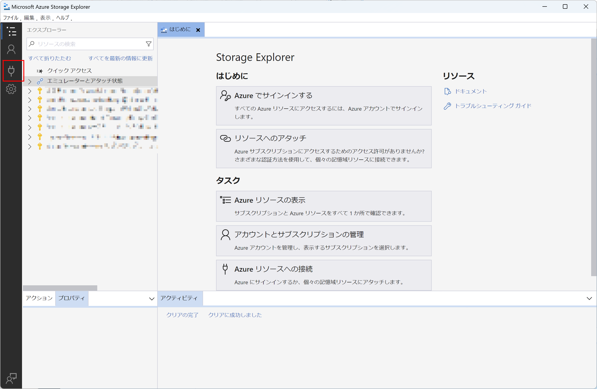

    1. 「リソースの選択」にて「ストレージアカウントまたはサービス」を選択

    1. 「接続方法の選択」にて「接続文字列（キーまたはSAS）」を選択して「次へ」

    1. 「接続情報の入力」にて、以下を入力して「次へ」

        * 表示名： （任意。接続文字列を貼り付けると自動入力される）
        * 接続文字列： （Azureポータルにて確認した接続文字列）

    1. 「概要」にて内容を核にんして「接続」

    1. うまく接続できていれば「エクスプローラー」にストレージアカウントが追加される

        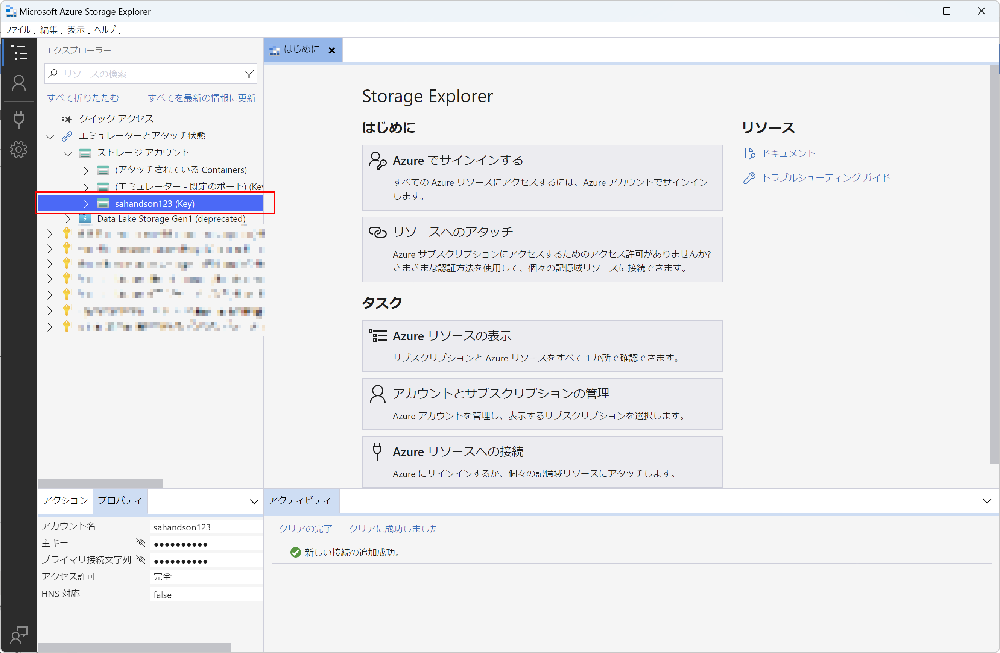

1. ストレージ内の内容確認

    1. エクスプローラー上からフォルダをたどって、Azureポータルからアップロードしたファイルを確認

        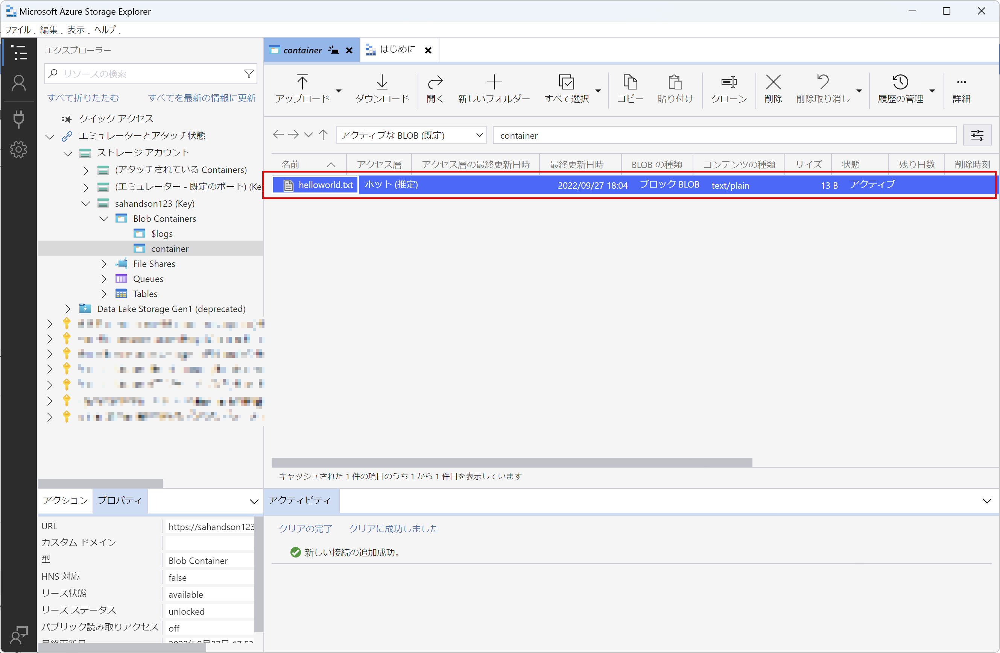

    1. ファイルをダブルクリックして開けることを確認

        

1. ドラッグ＆ドロップでファイルアップロードできることを確認

    1. 適当なファイルを Storage Explorer で開いているコンテナに対してドラッグ＆ドロップ

        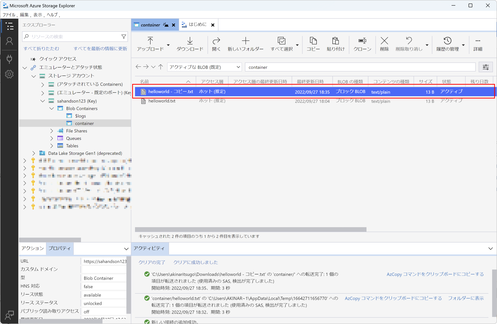

    1. AzureポータルからBlobコンテナーを開いてファイルが追加されていることを確認

        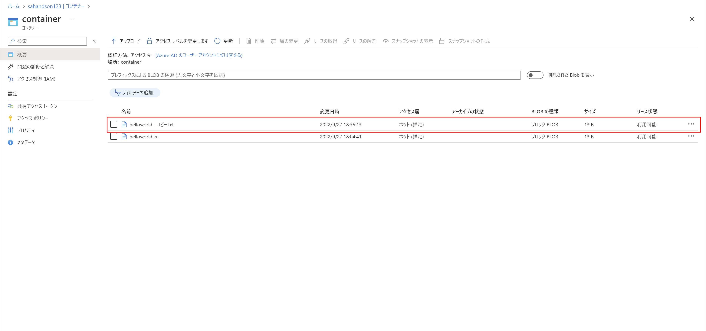

