# Exercise2: Blob閉域化/接続

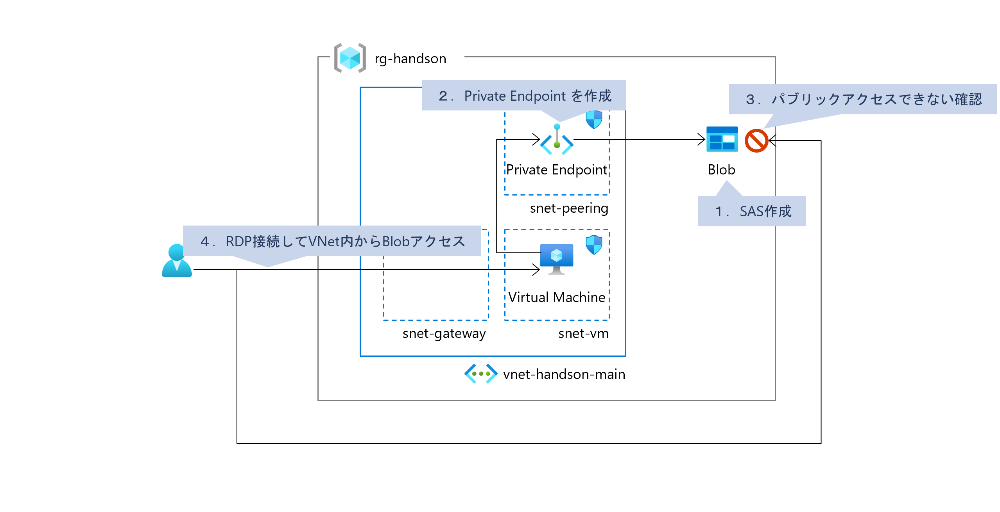

### ⏳ 推定時間

- 10 ~ 15分

### 🗒️ 目次

1. [アクセス確認用のSASを準備](#アクセス確認用のsasを準備)
1. [Private Endpoint を作成](#private-endpoint-を作成)
1. [パブリックアクセスできないことを確認](#パブリックアクセスできないことを確認)
1. [VNet内からBlobアクセスできることを確認](#vnet内からblobアクセスできることを確認)

## アクセス確認用のSASを準備

1. Azureポータルから作成済みの「ストレージアカウント」を開く

1. [データストレージ]-[コンテナー] を開く

1. 作成済みの「コンテナー」を開く

1. アップロード済みのファイルに対してSASを生成、メモしておく

    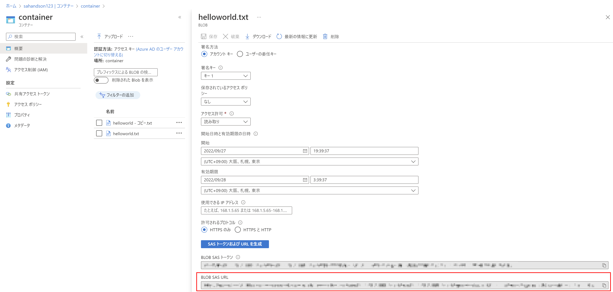

## Private Endpoint を作成

1. Azureポータルから作成済みの「ストレージアカウント」を開く

1. [セキュリティとネットワーク]-[ネットワーク]を開く

1. 「プライベートエンドポイント接続」タブへ移動

    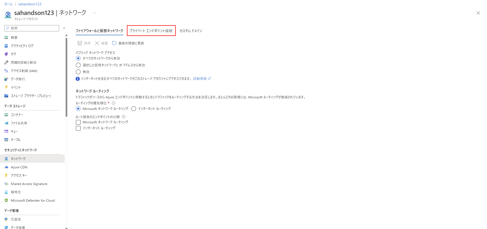

1. 「プライベートエンドポイント」を選択

    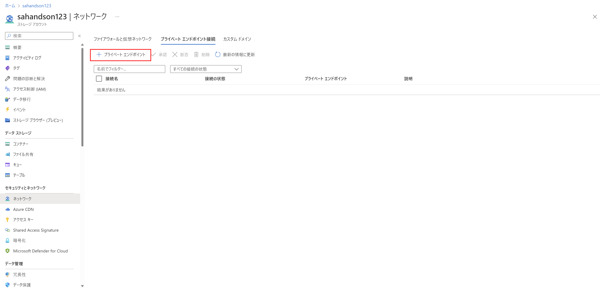

1. プライベートエンドポイントの作成

    1. 「基本」ページ

        * サブスクリプション： （ハンズオン用のものを利用）
        * リソースグループ： （準備で作成したものを利用）
        * 名前： （任意）
        * ネットワークインターフェイス名： （任意）
        * 地域： `Japan East`

        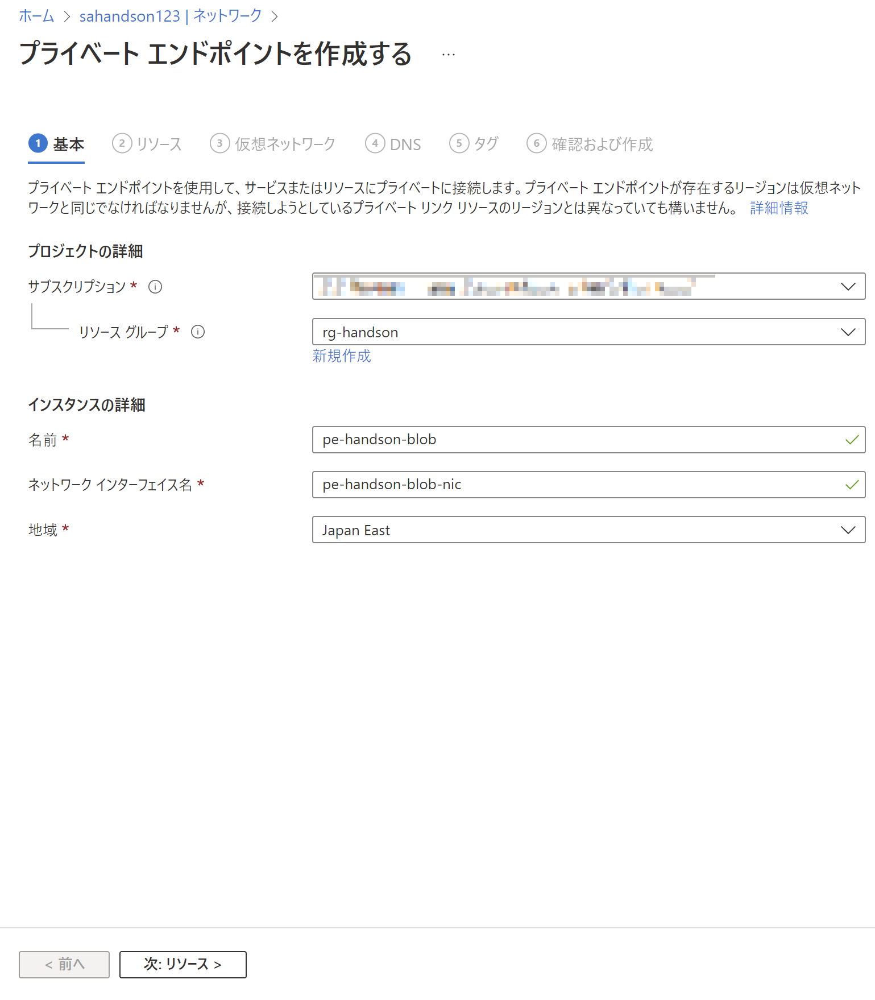

    1. 「リソース」ページ

        * 対象サブリソース： `blob`

        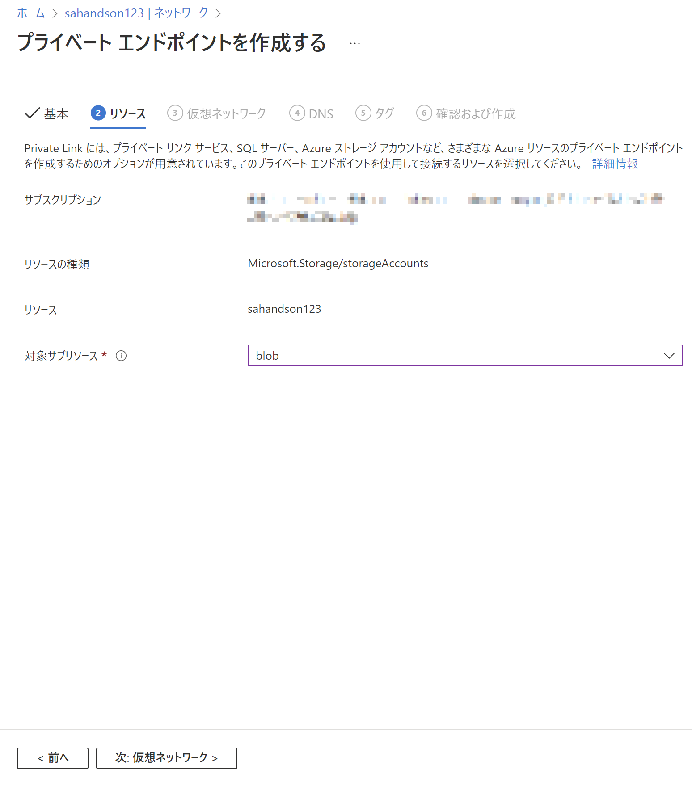

    1. 「仮想ネットワーク」ページ

        * 仮想ネットワーク： （作成済みの仮想ネットワーク）
        * サブネット： `snet-peering` （プライベートエンドポイント配置用サブネット）

        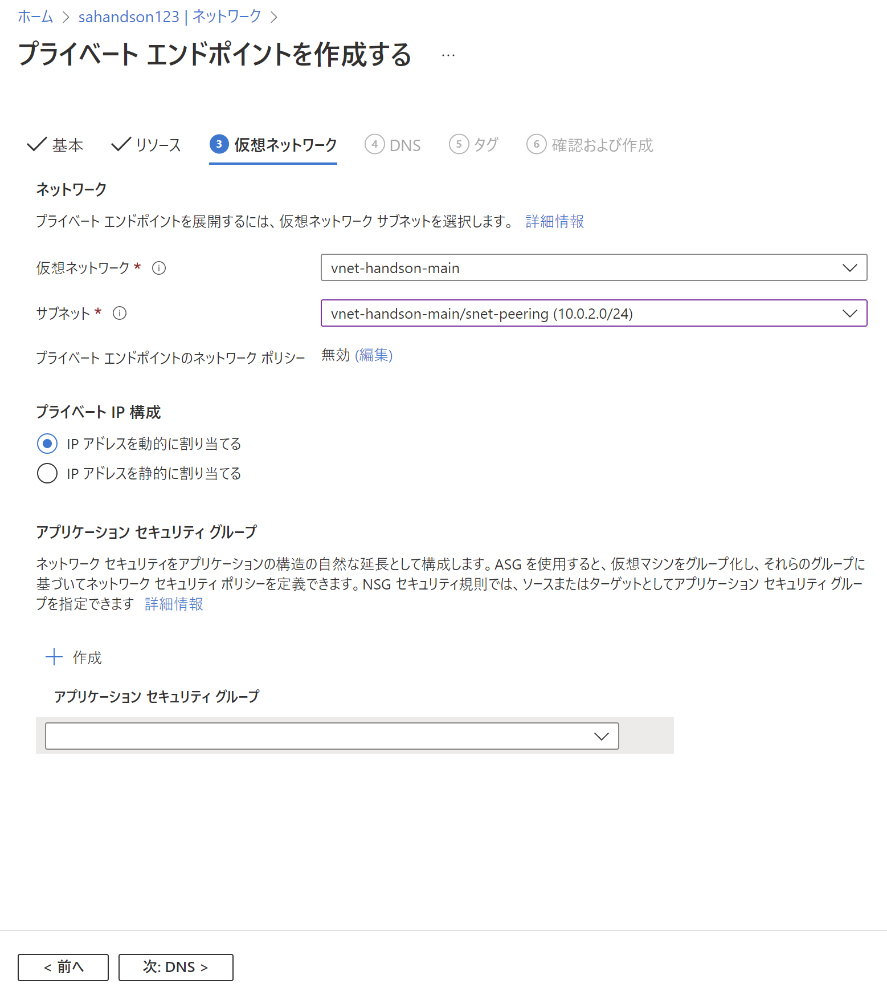

    1. 「DNS」ページ

        * プライベートDNSゾーンと統合する： `はい`

        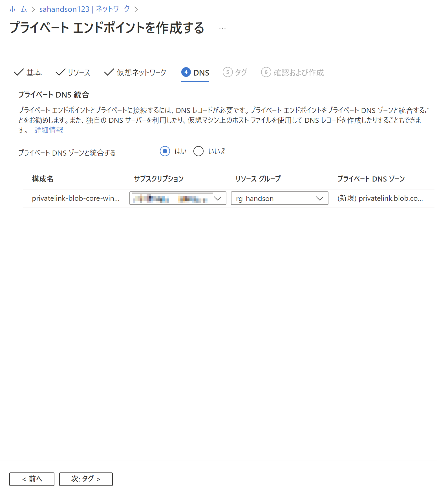

    1. 「タグ」ページ

        特に指定なし

    1. 「確認および作成」ページ

        内容を確認して「作成」

1. Azureポータルから作成済みの「ストレージアカウント」を開く

1. [セキュリティとネットワーク]-[ネットワーク]を開く

1. 「ファイアウォールと仮想ネットワーク」にある「パブリックネットワークアクセス」を `無効` にして「保存」

    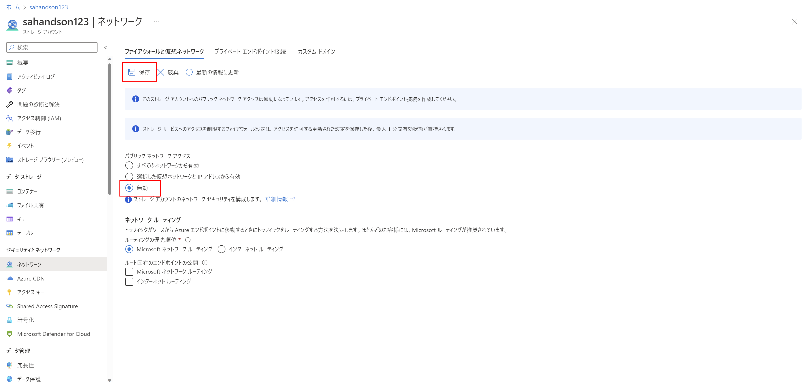

## パブリックアクセスできないことを確認

1. Azureポータルから作成済みの「ストレージアカウント」を開く

1. [データストレージ]-[コンテナー] を開く

1. 作成したコンテナーを開く

    アクセス出来なくなったことを確認

    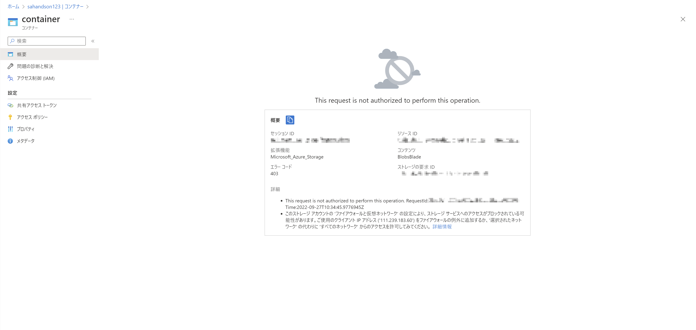

1. あらかじめメモしておいたSASを使ってアクセス

    アクセスできないことを確認

    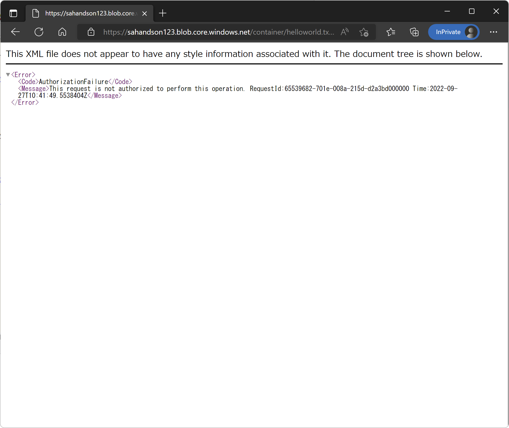

## VNet内からBlobアクセスできることを確認

1. あらかじめ作成済みの仮想マシンへRDP接続

    (*) 接続できない場合、NSGを確認

1. Edgeを立ち上げて、あらかじめメモしておいた SAS にアクセス

    アクセスできることを確認

    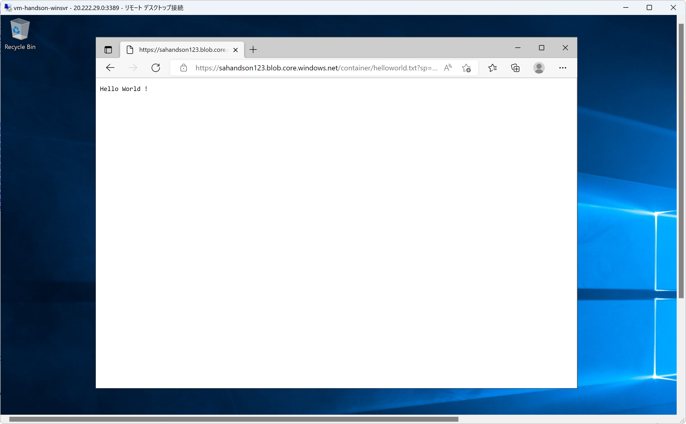

# 次の Exercise へ

* [Files作成/接続](exercise03.md)

