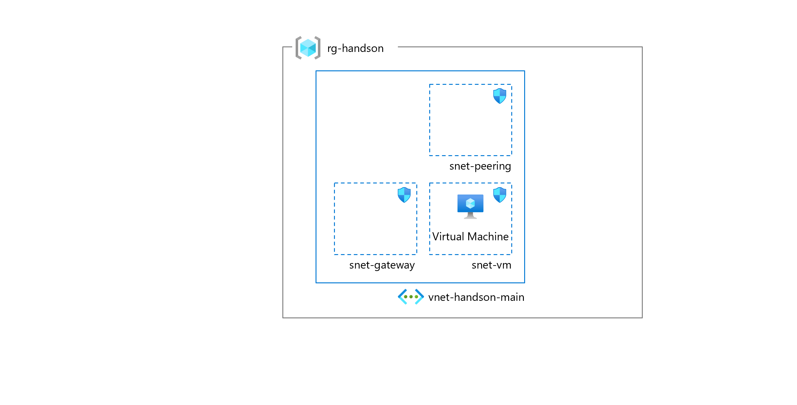
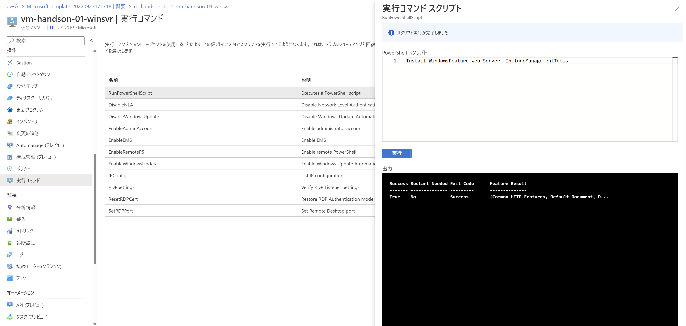

# Exercise0: 事前準備

## 【目次】

## Azureへリソースを展開

1. 以下のボタンからテンプレートを展開

    

1. 作成したリソースから仮想マシンを開く

1. [操作]-[実行コマンド] を開く

1. `RunPowerShellScript` を選択、以下のコマンドを入力して「実行」

        Install-WindowsFeature Web-Server -IncludeManagementTools 

    

## Storage Explorer のインストール

本ハンズオンでは Storage Explorer を利用します。
事前に以下のリンクからダウンロードしてインストールを行ってください。

* [Azure Storage Explorer](https://azure.microsoft.com/ja-jp/products/storage/storage-explorer/#overview)

